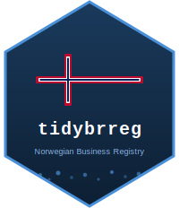

# tidybrreg 

<!-- badges: start -->

[](https://github.com/sondreskarsten/tidybrreg/actions/workflows/R-CMD-check.yaml)
[](https://lifecycle.r-lib.org/articles/stages.html#experimental)
<!-- badges: end -->

Tidy R interface to Norway’s [Central Coordinating Register for Legal
Entities](https://www.brreg.no/en/) (Enhetsregisteret), maintained by
the Brønnøysund Register Centre. The register contains approximately 1
million active entities. Data is freely available under the [Norwegian
Licence for Open Government Data (NLOD
2.0)](https://data.norge.no/nlod/en/2.0).

## Installation

``` r
# install.packages("pak")
pak::pak("sondreskarsten/tidybrreg")

# For snapshot/panel features, also install a parquet backend:
install.packages("nanoparquet")  # lightweight
# OR
install.packages("arrow")       # full-featured (lazy queries)
```

## Entity lookup

``` r
library(tidybrreg)

brreg_entity("923609016")
#> # A tibble: 1 x 65
#>   org_nr    name        legal_form founding_date employees nace_1
#>   <chr>     <chr>       <chr>      <date>            <int> <chr>
#> 1 923609016 EQUINOR ASA ASA        1972-09-18        21408 06.100

# Sub-entities (establishments)
brreg_entity("974760843", registry = "underenheter")
```

Codes by default. Translate with `type = "label"` or `brreg_label()`:

``` r
brreg_entity("923609016", type = "label")

brreg_entity("923609016") |>
  brreg_label(code = c("legal_form", "nace_1"))
```

## Search

``` r
brreg_search(legal_form = "AS", municipality_code = "0301",
             min_employees = 500, max_results = 10)

# Sub-entity search
brreg_search(name = "Equinor", registry = "underenheter", max_results = 5)
```

## Roles and governance

``` r
# Who holds roles IN an entity
brreg_roles("923609016")
brreg_roles("923609016") |> brreg_board_summary()

# What roles does an entity hold in OTHER entities (reverse lookup)
brreg_roles_legal("923609016")
#> # A tibble: 70 x 8
#>   org_nr    target_org_nr target_name                      role       share
#>   <chr>     <chr>         <chr>                            <chr>      <chr>
#> 1 923609016 819334552     TECHNOLOGY CENTRE MONGSTAD DA    Partner... 22%
#> 2 923609016 925461784     EQUINOR DEZASSETE AS             Accountant NA
```

## Bulk downloads

Three registries available as bulk downloads:

``` r
# Enheter: ~152 MB CSV or ~196 MB JSON
entities <- brreg_download(type = "enheter")
entities <- brreg_download(type = "enheter", format = "json")

# Underenheter: ~59 MB CSV
sub_entities <- brreg_download(type = "underenheter")

# Roller: ~131 MB JSON (all roles for all entities)
roles <- brreg_download(type = "roller")
```

## Snapshot engine

Save dated bulk downloads as Hive-partitioned Parquet. Raw `.gz` files
are preserved for provenance.

``` r
brreg_snapshot("enheter")
brreg_snapshot("underenheter")
brreg_snapshot("roller")

# Import historical CSVs
brreg_import("enheter_2024-12-31.csv.gz", snapshot_date = "2024-12-31")

# List snapshots and provenance metadata
brreg_snapshots()
brreg_manifest()
```

## Panel construction

Two paths for building firm-period panels:

``` r
# Path A: multi-snapshot diff
panel <- brreg_panel(
  frequency = "year",
  cols = c("employees", "nace_1", "legal_form", "municipality_code")
)

# Path B: single snapshot + CDC replay
base <- brreg_download(type_output = "tibble")
cdc <- brreg_updates(since = "2025-09-23", size = 10000, include_changes = TRUE)
state_dec <- brreg_replay(base, cdc, target_date = "2025-12-31")

# Detect entries, exits, field changes between two snapshots
events <- brreg_events("2024-01-01", "2025-01-01")
events |> dplyr::count(event_type)
```

## Time series

Aggregate any variable with any summary function, grouped by any column:

``` r
# Total employees by legal form per year
brreg_series(.vars = "employees", by = "legal_form")

# Multiple summaries
brreg_series(.vars = "employees",
             .fns = list(avg = mean, total = sum),
             by = "nace_1")

# Entity counts (default when .vars = NULL)
brreg_series(by = "legal_form")

# Convert to tsibble for tidyverts ecosystem
brreg_series(.vars = "employees") |> as_brreg_tsibble()
```

## Harmonization

``` r
panel |> brreg_harmonize_kommune(target_date = "2024-01-01")
panel |> brreg_harmonize_nace(from = "SN2007", to = "SN2025")
```

## Governance research

``` r
net <- brreg_board_network(c("923609016", "984851006"))
surv <- brreg_search(legal_form = "AS", max_results = 1000) |>
  brreg_survival_data()
```

## Validate organization numbers

``` r
library(tidybrreg)
brreg_validate(c("923609016", "984851006", "123456789"))
#> [1]  TRUE  TRUE FALSE
```

## Design

**Codes by default, labels on demand.** Functions return Norwegian
codes. `brreg_label()` translates to English via bundled reference data
or live SSB Klass API lookups.

**Algorithmic unnesting.** JSON nested objects and list columns are
flattened to atomic types. Character vectors are collapsed, data frames
serialized, HAL links dropped. Both CSV and JSON paths share
`rename_and_coerce()` — no hardcoded format parity.

**Zero-drop policy.** Unknown API fields pass through with
auto-generated snake_case names. Schema evolution handled by
`arrow::open_dataset(unify_schemas = TRUE)`.

**Provenance tracking.** Raw download files preserved alongside
processed Parquet. JSON manifest records HTTP headers (`Last-Modified`
for data vintage, ETag for change detection), file hashes, and record
counts.

**Two panel construction paths.** Multi-snapshot diff (`brreg_panel()`)
for historical analysis. Single snapshot + CDC replay (`brreg_replay()`)
for forward reconstruction.

## Functions

| Function                    | Description                                                    |
|-----------------------------|----------------------------------------------------------------|
| `brreg_entity()`            | Single entity by organization number (enheter or underenheter) |
| `brreg_search()`            | Filtered search (enheter or underenheter)                      |
| `brreg_roles()`             | Board members, officers, auditors for an entity                |
| `brreg_roles_legal()`       | Reverse: roles an entity holds in other entities               |
| `brreg_board_summary()`     | Board-level covariates from role data                          |
| `brreg_download()`          | Full register bulk download (enheter, underenheter, roller)    |
| `brreg_updates()`           | Incremental change stream (enheter, underenheter, roller)      |
| `brreg_label()`             | Translate codes to English descriptions                        |
| `brreg_validate()`          | Organization number validation (modulus-11)                    |
| `get_brreg_dic()`           | Fetch/cache NACE or sector dictionaries                        |
| `brreg_snapshot()`          | Save dated bulk download as Parquet + raw file                 |
| `brreg_import()`            | Import historical CSV as snapshot partition                    |
| `brreg_snapshots()`         | List available snapshots                                       |
| `brreg_manifest()`          | Read download provenance catalog                               |
| `brreg_open()`              | Open snapshot store as lazy Arrow Dataset                      |
| `brreg_cleanup()`           | Remove old snapshot partitions                                 |
| `brreg_panel()`             | Firm x period panel from snapshots                             |
| `brreg_replay()`            | Reconstruct state from snapshot + CDC updates                  |
| `brreg_events()`            | Snapshot diff: entries, exits, field changes                   |
| `brreg_series()`            | Aggregate time series (any variable, any function)             |
| `as_brreg_tsibble()`        | Convert to tsibble for tidyverts ecosystem                     |
| `brreg_harmonize_kommune()` | Municipality code harmonization                                |
| `brreg_harmonize_nace()`    | NACE code harmonization (SN2007/SN2025)                        |
| `brreg_board_network()`     | Director interlock network (tidygraph)                         |
| `brreg_survival_data()`     | Firm survival data preparation                                 |
| `brreg_data_dir()`          | Snapshot store location                                        |

## License

MIT. Data from Enhetsregisteret is available under [NLOD
2.0](https://data.norge.no/nlod/en/2.0).
